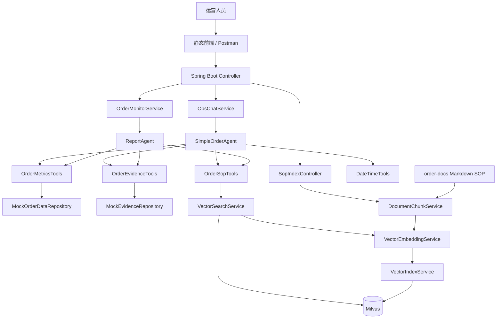

# OrderWatch Mini：电商异常订单监控 Agent 骨架版产品文档

文档版本：v2.0  
项目定位：从 0 搭建的 Agent + Tool + Milvus RAG 学习型项目  
目标读者：初学者、课程答辩者、想理解 Agent 核心链路的项目实现者  
项目名称：`OrderWatch Mini：电商异常订单监控 Agent 骨架版`

---

## 1. 文档结论

本项目不是完整电商平台，也不是完整风控系统，而是一个用于学习和演示的 **电商异常订单监控 Agent 骨架项目**。

本项目必须保留 Milvus，因为 Milvus 是理解 RAG 链路的重要部分。

第一版只做四件事：

1. 使用 Mock 数据模拟异常订单、支付记录、客服工单。
2. 使用 Tool 让 Agent 能查询异常订单指标和订单证据。
3. 使用 Milvus 存储和检索运营 SOP 文档，实现真实 RAG 链路。
4. 提供普通问答和一键生成异常订单报告两个核心接口。

本项目不接入真实订单数据库，不接入真实支付系统，不接入真实客服系统，不实现复杂风控模型。

本项目的核心学习目标是理解这条链路：

```text
用户问题
→ Agent 判断需要哪些信息
→ 调用 Tool
→ Tool 查询 Mock 异常订单 / Mock 证据 / Milvus SOP
→ Agent 基于事实和规则生成回答或报告
```

其中：

```text
订单事实：来自 Mock 数据
处理规则：来自 Milvus RAG
最终表达：由 Agent 组织生成
```

---

## 2. 产品定位

### 2.1 一句话定位

`OrderWatch Mini` 是一个面向电商运营场景的异常订单监控 Agent 骨架项目，用于演示 Agent 如何通过 Tool 获取业务事实，并通过 Milvus RAG 检索 SOP 规则，最终生成可解释的运营问答和异常订单报告。

### 2.2 项目目标

本项目的目标不是做完整业务，而是让开发者真正理解：

- AI 本身不保存订单数据。
- AI 通过 Tool 获取订单相关信息。
- Tool 背后可以是 Mock 数据、数据库、日志系统或外部接口。
- SOP 文档通过 Embedding 写入 Milvus。
- Agent 检索 SOP 后，结合异常订单事实生成回答。

### 2.3 适用场景

| 场景 | 说明 |
|---|---|
| 课程项目 | 展示 Agent、Tool、RAG、Milvus、报告生成能力 |
| 答辩 Demo | 演示异常订单问答和一键报告生成 |
| 学习项目 | 理解 AI 如何通过工具和外部数据交互 |
| 技术骨架 | 后续可以扩展真实数据库、真实风控、真实客服系统 |

---

## 3. 产品边界

### 3.1 本项目要做

- Spring Boot 后端项目。
- Milvus Standalone 本地向量数据库。
- SOP Markdown 文档读取、分片、Embedding、写入 Milvus。
- 从 Milvus 检索 SOP 片段。
- Mock 异常订单数据。
- Mock 订单证据数据。
- Agent 普通问答接口。
- 一键异常订单监控报告接口。
- 最小静态前端或 Postman 调试。

### 3.2 本项目不做

- 不做完整电商后台。
- 不做订单增删改查。
- 不做真实支付风控。
- 不接真实订单数据库。
- 不接真实客服工单系统。
- 不做复杂权限系统。
- 不做 BI 大屏。
- 不做自动退款。
- 不做自动封单。
- 不做多模型路由。

### 3.3 保留和简化

| 模块 | 第一版处理方式 |
|---|---|
| 异常订单数据 | Mock |
| 订单证据 | Mock |
| 支付记录 | Mock |
| 客服工单 | Mock |
| SOP 文档 | 真实 Markdown 文件 |
| 文档分片 | 真实实现 |
| Embedding | 建议真实实现，可临时 Fake |
| Milvus 入库 | 真实实现 |
| Milvus 检索 | 真实实现 |
| Agent 判断 | 第一版可用 if，第二版接入大模型 |
| 报告生成 | 第一版可模板拼接，第二版接入大模型 |

---

## 4. 核心业务场景

### 4.1 场景一：查询异常订单

运营人员输入：

```text
最近 24 小时有哪些异常订单？
```

系统流程：

```text
用户提问
→ /api/ops_chat
→ SimpleOrderAgent 判断问题与异常订单有关
→ 调用 OrderMetricsTools.queryOrderAnomalies()
→ OrderMetricsTools 从 MockOrderDataRepository 读取异常订单
→ Agent 汇总返回
```

系统返回示例：

```text
最近 24 小时发现 3 类异常订单：
1. 大额订单异常：ORDER-20260427-001，金额 12999 元，风险等级 high。
2. 频繁取消订单异常：USER-20488，24 小时内下单 8 次，取消 6 次。
3. 同地址多账号下单异常：ADDR-MOCK-009，关联 5 个新用户账号。
```

---

### 4.2 场景二：查询异常订单处理规则

运营人员输入：

```text
大额订单异常应该怎么处理？
```

系统流程：

```text
用户提问
→ /api/ops_chat
→ SimpleOrderAgent 判断问题与 SOP 有关
→ 调用 OrderSopTools.queryOrderSop("大额订单异常处理规则")
→ VectorSearchService 生成 query embedding
→ Milvus 检索最相关 SOP chunk
→ Agent 根据 SOP 片段生成回答
```

系统返回示例：

```text
根据命中的《大额订单人工审核规则》，当订单金额显著高于店铺平均客单价时，运营应先进行人工审核，重点核对支付状态、收货地址、历史消费水平和客服备注。在审核完成前，不建议立即发货。
```

---

### 4.3 场景三：查询异常订单证据

运营人员输入：

```text
为什么说这个大额订单异常？
```

系统流程：

```text
用户提问
→ /api/ops_chat
→ SimpleOrderAgent 判断需要订单证据
→ 调用 OrderEvidenceTools.queryOrderEvidence(topic, query)
→ OrderEvidenceTools 从 MockEvidenceRepository 查询证据
→ Agent 汇总证据
```

系统返回示例：

```text
该订单被标记为大额异常，主要依据包括：
1. 订单金额为 12999 元，明显高于店铺平均客单价 389 元。
2. 收货地址为首次使用地址。
3. 用户历史客单价低于 400 元。
4. 客服备注中出现“要求尽快发货”的信息。
```

---

### 4.4 场景四：一键生成异常订单监控报告

运营人员点击：

```text
异常订单监控
```

系统流程：

```text
点击按钮
→ /api/order_anomaly_monitor
→ OrderMonitorService
→ 查询 Mock 异常订单
→ 查询 Mock 证据
→ 从 Milvus 检索 SOP
→ ReportAgent 生成 Markdown 报告
```

报告必须包含：

- 异常概览
- 异常订单清单
- 证据摘要
- 命中的 SOP
- 可能原因
- 处理建议
- 需要人工确认的事项

---

## 5. 总体架构

### 5.1 架构图



### 5.2 核心分层

| 层级 | 职责 |
|---|---|
| Controller | 接收 HTTP 请求 |
| Service | 组织业务流程 |
| Agent | 判断问题、组织回答或报告 |
| Tool | 暴露 Agent 可调用的能力 |
| Mock Repository | 提供模拟订单事实 |
| RAG Service | 文档分片、向量化、入库、检索 |
| Milvus | 存储和检索 SOP 向量 |

---

## 6. 技术选型

| 类型 | 选型 | 说明 |
|---|---|---|
| 开发语言 | Java 17 | 与现代 Spring Boot 项目一致 |
| Web 框架 | Spring Boot 3.x | 提供 REST API 和静态资源服务 |
| 构建工具 | Maven | 管理依赖和构建 |
| 向量数据库 | Milvus Standalone | 本地运行，存储 SOP 向量 |
| 文档格式 | Markdown | 用于运营 SOP 文档 |
| Embedding | DashScope text-embedding-v4 / FakeEmbedding | 推荐真实 Embedding，允许临时 Fake |
| 大模型 | DashScope Chat Model / 暂不接入 | 第一版可不用大模型，第二版接入 |
| 前端 | 原生 HTML / CSS / JS | 第一版可省略复杂前端 |
| 数据源 | Mock 数据 | 不接真实订单系统 |

---

## 7. 目录结构设计

```text
order-watch/
├─ README.md
│  # 仓库说明与运行方式（同仓库前后端分离）
│
├─ backend/
│  # Spring Boot 后端项目（主交付物）
│  ├─ docker-compose.yml
│  │  # 启动 Milvus Standalone 所需配置
│  ├─ pom.xml
│  ├─ order-docs/
│  │  # 本地 SOP 原始文档目录
│  └─ src/main/
│     ├─ java/com/example/orderwatch/
│     └─ resources/
│        └─ application.yml
│
└─ frontend/
   # 前端项目（独立构建与部署，通过 HTTP 调用后端 API）
   ├─ package.json
   ├─ vite.config.*
   └─ src/
```

---

## 8. 接口设计

### 8.1 健康检查

```text
GET /ping
```

响应：

```json
{
  "code": 200,
  "message": "success",
  "data": "pong"
}
```

---

### 8.2 Milvus 健康检查

```text
GET /milvus/health
```

响应：

```json
{
  "code": 200,
  "message": "success",
  "data": {
    "connected": true,
    "collectionName": "order_sop_chunks"
  }
}
```

---

### 8.3 本地 SOP 文档入库

```text
POST /api/sop/index-local-docs
```

说明：

读取 `order-docs/` 目录下的 Markdown 文档，执行分片、Embedding、写入 Milvus。

响应：

```json
{
  "code": 200,
  "message": "success",
  "data": {
    "fileCount": 4,
    "chunkCount": 12,
    "collectionName": "order_sop_chunks"
  }
}
```

---

### 8.4 SOP 检索测试

```text
GET /api/sop/search?query=大额订单人工审核
```

响应：

```json
{
  "code": 200,
  "message": "success",
  "data": [
    {
      "fileName": "大额订单人工审核规则.md",
      "chunkIndex": 0,
      "score": 0.82,
      "content": "当订单金额显著高于店铺平均客单价时，应进入人工审核..."
    }
  ]
}
```

---

### 8.5 运营问答接口

```text
POST /api/ops_chat
Content-Type: application/json
```

请求：

```json
{
  "question": "大额订单异常应该怎么处理？"
}
```

响应：

```json
{
  "code": 200,
  "message": "success",
  "data": {
    "success": true,
    "answer": "根据命中的 SOP，大额订单应先进入人工审核...",
    "errorMessage": null
  }
}
```

---

### 8.6 一键异常订单监控报告

```text
POST /api/order_anomaly_monitor
```

响应：

```json
{
  "code": 200,
  "message": "success",
  "data": "# 异常订单监控报告\n\n## 1. 异常概览..."
}
```

第一版可以直接返回完整 Markdown 字符串。后续可以扩展为 SSE 流式输出。

---

## 9. 数据模型设计

### 9.1 OpsChatRequest

```java
public class OpsChatRequest {
    private String question;
}
```

---

### 9.2 OpsChatResponse

```java
public class OpsChatResponse {
    private boolean success;
    private String answer;
    private String errorMessage;
}
```

---

### 9.3 OrderAnomaly

```java
public class OrderAnomaly {
    private String anomalyId;
    private String orderId;
    private String userId;
    private String productId;
    private String skuId;
    private String anomalyType;
    private String metric;
    private String currentValue;
    private String baselineValue;
    private String timeWindow;
    private String severity;
    private String summary;
}
```

字段说明：

| 字段 | 说明 |
|---|---|
| anomalyId | 异常 ID |
| orderId | 订单 ID |
| userId | 用户 ID |
| anomalyType | 异常类型 |
| metric | 异常指标 |
| currentValue | 当前值 |
| baselineValue | 基线值 |
| timeWindow | 时间窗口 |
| severity | 风险等级 |
| summary | 异常摘要 |

---

### 9.4 OrderEvidenceRecord

```java
public class OrderEvidenceRecord {
    private String topic;
    private String recordId;
    private String orderId;
    private String userId;
    private String timestamp;
    private String evidenceType;
    private String content;
    private Map<String, String> tags;
}
```

证据 topic：

| topic | 说明 |
|---|---|
| order-records | 订单记录 |
| payment-records | 支付记录 |
| customer-tickets | 客服工单 |

---

### 9.5 DocumentChunk

```java
public class DocumentChunk {
    private String id;
    private String fileName;
    private String content;
    private int chunkIndex;
    private int startIndex;
    private int endIndex;
    private String title;
}
```

---

### 9.6 SopSearchResult

```java
public class SopSearchResult {
    private String id;
    private String fileName;
    private int chunkIndex;
    private String title;
    private String content;
    private double score;
}
```

---

## 10. Milvus 设计

### 10.1 Collection 名称

```text
order_sop_chunks
```

### 10.2 字段设计

| 字段 | 类型 | 说明 |
|---|---|---|
| id | VarChar | 主键，文件名 + chunkIndex 生成 |
| content | VarChar | SOP 文档片段内容 |
| vector | FloatVector | 文本向量 |
| fileName | VarChar | 来源文件名 |
| chunkIndex | Int64 | 分片序号 |
| title | VarChar | Markdown 标题，可选 |

### 10.3 向量维度

如果使用 DashScope `text-embedding-v4`：

```text
vector dimension = 1024
```

如果使用 FakeEmbedding：

```text
也保持 1024 维，方便后续替换真实 Embedding
```

### 10.4 入库流程

```text
读取 Markdown 文件
→ DocumentChunkService 分片
→ VectorEmbeddingService 生成向量
→ VectorIndexService 写入 Milvus
```

### 10.5 检索流程

```text
用户 query
→ VectorEmbeddingService 生成 query 向量
→ VectorSearchService 调用 Milvus search
→ 返回 topK 个 SopSearchResult
```

---

## 11. Tool 设计

### 11.1 OrderMetricsTools

作用：查询异常订单指标。

方法：

```java
public List<OrderAnomaly> queryOrderAnomalies()
```

第一版实现：

```text
从 MockOrderDataRepository 返回三条固定异常订单
```

---

### 11.2 OrderEvidenceTools

作用：查询订单相关证据。

方法：

```java
public List<OrderEvidenceRecord> queryOrderEvidence(String topic, String query, int limit)
```

第一版支持 topic：

```text
order-records
payment-records
customer-tickets
```

---

### 11.3 OrderSopTools

作用：从 Milvus 检索 SOP。

方法：

```java
public List<SopSearchResult> queryOrderSop(String query)
```

内部流程：

```text
OrderSopTools
→ VectorSearchService
→ VectorEmbeddingService
→ Milvus
```

注意：

Agent 不直接访问 Milvus。Agent 只能通过 Tool 间接获取 SOP。

---

### 11.4 DateTimeTools

作用：获取当前时间。

方法：

```java
public String getCurrentDateTime()
```

---

## 12. Mock 数据设计

### 12.1 大额订单异常

```text
异常 ID：ANOM-001
订单：ORDER-20260427-001
用户：USER-10086
类型：large_amount_order
表现：订单金额 12999 元，显著高于店铺客单价 389 元
风险等级：high
建议：进入人工审核，不立即发货
```

### 12.2 频繁取消订单异常

```text
异常 ID：ANOM-002
用户：USER-20488
类型：frequent_cancellation
表现：同一用户 24 小时内下单 8 次，取消 6 次
风险等级：medium
建议：客服确认真实购买意图，必要时限制优惠券使用
```

### 12.3 同地址多账号下单异常

```text
异常 ID：ANOM-003
地址：ADDR-MOCK-009
类型：same_address_multi_account
表现：同一收货地址关联 5 个新用户账号
风险等级：high
建议：人工审核活动资格，避免误伤真实用户
```

---

## 13. SOP 文档设计

### 13.1 大额订单人工审核规则.md

建议内容：

```text
# 大额订单人工审核规则

## 触发条件
当订单金额超过店铺平均客单价 10 倍，或单笔订单金额超过 5000 元时，应进入人工审核。

## 核查内容
1. 支付状态是否成功。
2. 收货地址是否为首次使用地址。
3. 用户历史消费水平是否明显偏低。
4. 客服备注中是否存在催发货、异常要求等内容。

## 处理建议
审核完成前不建议立即发货。必要时联系用户确认购买意图。
```

### 13.2 频繁取消订单处理规则.md

建议内容：

```text
# 频繁取消订单处理规则

## 触发条件
同一用户在 24 小时内多次下单并取消，且取消比例明显高于正常用户。

## 核查内容
1. 是否反复锁定热门 SKU。
2. 是否反复使用优惠券。
3. 是否存在恶意占库存行为。

## 处理建议
客服应先确认用户真实购买意图。必要时限制优惠券使用或进入人工复核。
```

### 13.3 同地址多账号下单排查SOP.md

建议内容：

```text
# 同地址多账号下单排查 SOP

## 触发条件
同一收货地址在短时间内关联多个新用户账号，并购买同一活动商品。

## 核查内容
1. 收货电话是否相似。
2. 支付渠道是否相近。
3. 是否集中购买同一活动商品。
4. 是否存在批量薅券风险。

## 处理建议
进入人工审核，确认活动资格。审核时应避免误伤真实家庭用户或企业采购用户。
```

### 13.4 客服异常订单沟通话术.md

建议内容：

```text
# 客服异常订单沟通话术

## 大额订单确认话术
您好，由于您的订单金额较高，为保障账户和交易安全，我们需要进行人工核实。请您确认收货地址、商品数量和购买意图。

## 频繁取消订单沟通话术
您好，我们注意到您的账号近期存在多次下单后取消的情况。为了帮助您顺利购买，请问是否遇到了支付、库存或优惠券使用问题？

## 异常活动订单话术
您好，由于该商品处于活动期间，系统检测到订单需要进一步确认。请您耐心等待人工审核结果。
```

---

## 14. Agent 设计

### 14.1 第一版：规则 Agent

第一版不用真正大模型，先用关键词判断：

```text
如果问题包含“异常订单”“最近24小时”
→ 调用 queryOrderAnomalies

如果问题包含“大额订单”“频繁取消”“同地址”“怎么处理”
→ 调用 queryOrderSop

如果问题包含“为什么”“证据”“依据”
→ 调用 queryOrderEvidence
```

这样可以先理解 Agent 骨架：

```text
判断意图
→ 选择工具
→ 获取事实
→ 组织回答
```

### 14.2 第二版：接入大模型 Agent

第二版可以让大模型输出计划 JSON：

```json
{
  "needAnomalies": true,
  "needEvidence": true,
  "needSop": true,
  "sopQuery": "大额订单人工审核规则"
}
```

后端根据计划调用工具。

### 14.3 第三版：接入 Spring AI Tool Calling

第三版再把 Tool 交给 Agent 框架自动调用。

演进顺序：

```text
规则 Agent
→ LLM 规划 + 后端执行
→ Tool Calling Agent
```

---

## 15. 报告模板

```text
# 异常订单监控报告

## 1. 异常概览
说明时间窗口、异常类型、影响订单数、风险等级。

## 2. 异常订单清单
列出异常 ID、订单 ID、用户 ID、异常类型、风险等级和摘要。

## 3. 证据摘要
引用订单记录、支付记录和客服工单。

## 4. 命中的 SOP
列出从 Milvus 检索到的 SOP 文档片段。

## 5. 可能原因
基于证据给出可能原因，不写绝对结论。

## 6. 处理建议
给运营、客服、店铺负责人分别提供建议。

## 7. 需要人工确认的事项
列出必须人工复核的订单和规则。
```

---

## 16. 配置设计

`application.yml`：

```yaml
server:
  port: 9900

milvus:
  host: localhost
  port: 19530
  collection-name: order_sop_chunks
  vector-dimension: 1024

rag:
  top-k: 3
  docs-path: ./order-docs

embedding:
  provider: fake
  dimension: 1024
  dashscope:
    api-key: ${DASHSCOPE_API_KEY:}
    model: text-embedding-v4

order:
  mock-enabled: true
```

说明：

- `embedding.provider=fake` 表示先使用 FakeEmbedding。
- 后续改成 `embedding.provider=dashscope` 即可使用真实 Embedding。
- 不配置真实订单数据库。

---

## 17. 实现步骤

### 阶段一：项目启动与 Milvus 连接

目标：先确认 Spring Boot 和 Milvus 都能启动。

任务：

1. 创建 Spring Boot 项目。
2. 编写 `/ping`。
3. 编写 `docker-compose.yml` 启动 Milvus。
4. 编写 Milvus 配置类。
5. 编写 `/milvus/health`。

验收：

```text
GET /ping 返回 pong
GET /milvus/health 返回 connected=true
```

---

### 阶段二：创建 Milvus Collection

目标：初始化 `order_sop_chunks`。

任务：

1. 定义 collection 名称。
2. 定义字段：id、content、vector、fileName、chunkIndex、title。
3. 启动时检查 collection 是否存在。
4. 不存在则创建。

验收：

```text
Milvus 中存在 order_sop_chunks collection
```

---

### 阶段三：SOP 文档分片

目标：把 Markdown 文档切成 chunk。

任务：

1. 读取 `order-docs` 目录。
2. 只处理 `.md` 文件。
3. 按标题和段落分片。
4. 每个 chunk 控制在 500 到 800 字。
5. 生成 `DocumentChunk`。

验收：

```text
4 个 Markdown 文件可以被切成多个 DocumentChunk
```

---

### 阶段四：Embedding 与入库

目标：把 chunk 写入 Milvus。

任务：

1. 实现 `VectorEmbeddingService`。
2. 第一版可使用 FakeEmbedding 生成 1024 维向量。
3. 实现 `VectorIndexService`。
4. 提供 `POST /api/sop/index-local-docs`。

验收：

```text
调用 /api/sop/index-local-docs 后，Milvus 中有 SOP chunk 数据
```

---

### 阶段五：Milvus 检索

目标：根据 query 检索 SOP。

任务：

1. 实现 `VectorSearchService`。
2. 对 query 生成向量。
3. 调用 Milvus search。
4. 返回 topK 个 `SopSearchResult`。
5. 提供 `GET /api/sop/search`。

验收：

```text
GET /api/sop/search?query=大额订单人工审核
能返回相关 SOP chunk
```

---

### 阶段六：Mock 异常订单 Tool

目标：模拟业务事实。

任务：

1. 实现 `MockOrderDataRepository`。
2. 实现 `MockEvidenceRepository`。
3. 实现 `OrderMetricsTools`。
4. 实现 `OrderEvidenceTools`。

验收：

```text
queryOrderAnomalies 返回 3 个异常订单
queryOrderEvidence 返回订单记录、支付记录、客服工单
```

---

### 阶段七：普通问答 Agent

目标：跑通用户问答。

任务：

1. 实现 `SimpleOrderAgent`。
2. 实现 `OpsChatService`。
3. 实现 `POST /api/ops_chat`。
4. 根据关键词调用对应工具。

验收：

```text
问“最近24小时有哪些异常订单”能返回 Mock 异常订单
问“大额订单怎么处理”能从 Milvus 检索 SOP 并回答
```

---

### 阶段八：一键报告

目标：生成 Markdown 报告。

任务：

1. 实现 `OrderMonitorService`。
2. 查询异常订单。
3. 查询证据。
4. 检索 SOP。
5. 调用 `ReportAgent` 生成 Markdown。
6. 提供 `POST /api/order_anomaly_monitor`。

验收：

```text
接口能返回完整 Markdown 异常订单监控报告
```

---

## 18. 答辩演示流程

1. 启动 Milvus。
2. 启动 Spring Boot。
3. 访问 `/ping`，确认后端启动。
4. 访问 `/milvus/health`，确认 Milvus 可用。
5. 调用 `/api/sop/index-local-docs`，将 SOP 写入 Milvus。
6. 调用 `/api/sop/search?query=大额订单人工审核`，展示 Milvus 检索结果。
7. 调用 `/api/ops_chat`，提问“最近 24 小时有哪些异常订单？”
8. 调用 `/api/ops_chat`，提问“大额订单异常应该怎么处理？”
9. 调用 `/api/order_anomaly_monitor`，生成异常订单监控报告。

---

## 19. 验收标准

| 验收项 | 标准 |
|---|---|
| Spring Boot 启动 | `/ping` 可访问 |
| Milvus 连接 | `/milvus/health` 返回成功 |
| Collection 初始化 | `order_sop_chunks` 存在 |
| SOP 入库 | 本地 Markdown 可写入 Milvus |
| SOP 检索 | query 能返回相关 SOP chunk |
| 异常订单 Tool | 能返回 3 个 Mock 异常 |
| 证据 Tool | 能返回订单、支付、客服证据 |
| 普通问答 | 能根据问题调用不同 Tool |
| 报告生成 | 能生成 Markdown 异常订单报告 |
| 边界控制 | 不出现真实支付风控、真实订单库、复杂后台 |

---

## 20. 风险与规避

| 风险 | 规避方式 |
|---|---|
| Milvus 启动失败 | 优先使用 Docker Compose Standalone |
| Embedding API 不可用 | 第一版使用 FakeEmbedding，保持 1024 维 |
| FakeEmbedding 检索效果差 | SOP 文档少、关键词明显，后续替换真实 Embedding |
| 项目范围扩大 | 严格限制真实订单、支付、客服系统不接入 |
| Agent 逻辑混乱 | 第一版先用 if 判断意图 |
| 报告编造事实 | 报告只能使用 Mock 数据和 Milvus 检索结果 |
| RAG 链路不清楚 | 保持 DocumentChunk、Embedding、Index、Search 分层 |

---

## 21. 后续扩展方向

完成第一版后，可以按以下顺序扩展：

1. FakeEmbedding 替换为 DashScope `text-embedding-v4`。
2. 规则 Agent 替换为大模型规划 Agent。
3. 报告模板拼接替换为大模型生成。
4. 普通接口改为 SSE 流式输出。
5. 本地文档入库改为文件上传入库。
6. Mock 异常订单替换为数据库查询。
7. Mock 证据替换为真实日志、支付记录、客服工单。
8. 接入 Spring AI Tool Calling。
9. 接入 SupervisorAgent + PlannerAgent + ExecutorAgent。

---

## 22. 答辩表述建议

可以这样介绍项目：

```text
本项目是一个电商异常订单监控 Agent 骨架系统，重点展示 Agent、Tool 和 Milvus RAG 的协作链路。
系统中的订单异常和证据数据使用 Mock 实现，避免引入真实业务系统；但 SOP 文档采用真实 RAG 流程处理，包括 Markdown 文档读取、分片、Embedding、写入 Milvus 和向量检索。
在问答过程中，Agent 会根据用户问题调用不同 Tool：异常订单 Tool 负责返回 Mock 异常指标，证据 Tool 负责返回订单证据，SOP Tool 负责从 Milvus 检索运营规则。
最终系统可以回答运营问题，也可以一键生成异常订单监控报告。
这个项目的重点不是完整电商业务，而是理解 AI 如何通过 Tool 和外部数据交互。
```

---

## 23. 最终一致性检查

本产品文档满足以下约束：

- 从 0 搭建，不依赖老师示例项目。
- 保留 Milvus，完整实现 RAG 主链路。
- 订单、支付、客服数据使用 Mock，降低业务复杂度。
- 不做真实电商平台，不做真实风控。
- 包含核心技术点：Tool、Mock 数据、Milvus、Embedding、RAG、Agent、报告生成。
- 第一版可用规则 Agent，后续可升级为真实大模型 Agent。
- 适合两天左右完成一个可演示骨架版本。
